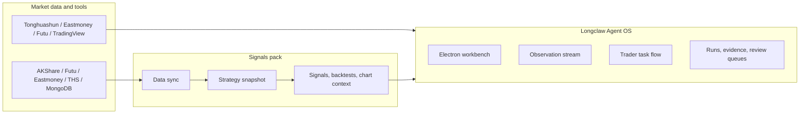
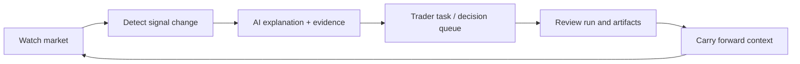

# Longclaw Agent OS

AI-first financial terminal workbench for the trader's second screen.

中文定位：开源 AI 原生 / AI-first 金融终端的“交易员第二屏”。

Longclaw Agent OS is an open, local-first workbench for real-time market signals,
AI explanations, evidence review, and trading observation tasks. It is not trying
to replace Tonghuashun, Eastmoney, Futu, Bloomberg, TradingView, or any full-market
quote terminal.

It sits beside them.

The first screen shows the market. Longclaw Agent OS turns the important changes
on that market into tasks, evidence, explanations, and reviewable decisions.

> Positioning: an AI-native second screen for active traders, analysts, and agent
> builders who need to track real-time signals, sector anomalies, key index changes,
> quantitative pivot points, strategy snapshots, AI explanations, and automated
> observation flows.

## Why This Exists

Traditional terminals are excellent at breadth:

- full-market quotes
- charting and order routing
- news, filings, and watchlists
- broker-specific entitlements and data depth

Longclaw Agent OS is built for depth around the moments that matter:

- What changed in key indices?
- Which sectors or concept chains are behaving abnormally?
- Which quantitative pivot points changed the strategy state?
- Which strategy candidates moved from "watch" to "act"?
- What evidence explains the AI interpretation?
- Which tasks should a trader review now, later, or after the close?

The product goal is a second screen that reduces cognitive load during live trading,
not another quote grid.

## Product Shape

Longclaw Agent OS is the workbench and runtime surface. It hosts the trader-facing
flows, while domain packs such as Signals produce the financial evidence.



## What Agent OS Owns

Longclaw Agent OS is the second-screen host for specialist packs.

| Area | What it does |
|------|--------------|
| Electron workbench | The desktop surface for Home, Runs, Work Items, Packs, and Studio. |
| Signals pack surface | A fixed professional workbench for market signals, chart context, candidates, warnings, and strategy KPIs. |
| Observation stream | Records what the trader or agent is observing, what changed, and what evidence was attached. |
| Trader task flow | Turns signal changes into reviewable work items, decision queues, and follow-up tasks. |
| Evidence and review | Keeps runs, artifacts, evidence, and review status visible instead of burying them in chat history. |
| Capability substrate | Manages curated skills, plugins, MCP connections, and local runtime capabilities. |
| Local runtime | Provides launchd, guardian, scheduler, local delivery, and recovery flows for a Mac-first setup. |

## What It Does Not Replace

Longclaw Agent OS does not try to be:

- a full-market quote terminal
- a broker client
- a Level 2 entitlement product
- a general charting replacement
- a generic plugin marketplace homepage

Use your existing quote terminal for breadth, depth of market, broker routing, and
licensed data. Use Agent OS when you need AI-native interpretation, evidence, and
task flow around the signals that deserve attention.

## Trader Workflow

1. Keep your main market terminal open as the first screen.
2. Run Signals data sync and workbench APIs.
3. Open Longclaw Agent OS as the second screen.
4. Watch the Signals pack surface for candidates, warnings, key index changes,
   sector/concept movement, and chart context.
5. Promote important changes into tasks, runs, observations, and reviewed evidence.

This is the intended loop:



## Relationship To Signals

Signals is the domain capability and evidence production layer.
Longclaw Agent OS is the workbench, orchestration, and review surface.

| Project | Role |
|---------|------|
| `Signals` | Data sync, strategy signals, industry-chain mapping, backtests, chart context, and strategy snapshots. |
| `longclaw-agent-os` | Second-screen workbench, observation flow, trader task flow, pack UI, governance, and local runtime. |
| `WeClaw` | Remote cowork companion for lightweight launch, status, and fallback dispatch. |
| `Hermes` | Canonical agent core for portable task/run/work-item semantics. |

## Quick Start

Clone and launch the desktop workbench:

```bash
git clone https://github.com/Gemini-Nick/longclaw-agent-os.git
cd longclaw-agent-os
bash bootstrap-dev.sh
npm run electron:start
```

For the full second-screen loop with Signals attached:

```bash
# In ../Signals
bash scripts/bootstrap-dev.sh
bash scripts/python.sh run.py --mode web --port 8011
bash scripts/python.sh run.py --mode web2 --port 6008

# In this repo
export LONGCLAW_SIGNALS_WEB_BASE_URL=http://127.0.0.1:8011
export LONGCLAW_SIGNALS_WEB2_BASE_URL=http://127.0.0.1:6008
npm run electron:start
```

For an observed product session that starts or attaches to Signals services and
opens Electron with observation logging:

```bash
npm run electron:observe
```

## Repository Map

```text
electron/          Desktop workbench, pack surfaces, task flows
src/               Agent SDK substrate and local control-plane client
apps/runtime/      Client runtime assets, launchd, guardian, scheduler
scripts/           Install, observation, runtime, and validation helpers
mcp-servers/       Local MCP services for specialist capabilities
docs/              Architecture, product boundary, UI/UX, and validation notes
```

## Documentation

- [Architecture](docs/ARCHITECTURE.md)
- [Product Boundary](docs/PRODUCT_BOUNDARY.md)
- [Trading Desk UI/UX Guidelines](docs/frontend-uiux-trading-desk-guidelines.md)
- [WeClaw to Client Validation](docs/VALIDATION_WECLAW_TO_CLIENT.md)

## Status

This repository is a local-first reference implementation for an AI-native trader
workbench. It is best used by builders who are comfortable running local services,
connecting market data sources, and validating financial evidence before acting on it.

Not financial advice. The workbench is for observation, explanation, and review.
Trading decisions remain the user's responsibility.

## License

No `LICENSE` file is currently included. Add an explicit open-source license before
public release or external contribution.
