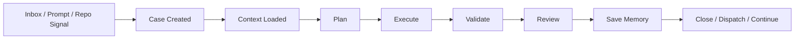

# Longclaw Electron UI/UX 推翻重构版

日期：2026-04-24

## 0. 结论

推翻原有 UI/UX 的核心不是换皮，而是换对象模型：

- 旧模型：按页面分区，`策略 / 回测 / 执行 / 微信 / 插件` 并列。
- 新模型：按工作流对象组织，`Case / Evidence / Capability / Memory` 成为一级对象。

旧导航不再是产品骨架，只作为能力模块存在。新的 Electron 应该是一个“任务控制台”，不是五个页面拼成的 dashboard。

一句话定位：

> Longclaw Electron 是本地多代理任务控制台：围绕一个 work item 聚合规划、执行、验证、证据、能力调用、微信入口和 MemPalace 记忆。

## 1. 本轮 skill 综合判断

这份方案使用全部前端 skill，但不是机械叠加。

| Skill | 对新方案的作用 |
| --- | --- |
| `frontend-uiux-pack` | 编排入口：先看真实 repo，再按场景路由设计、实现、测试、记忆。 |
| `frontend-skill` | 约束首屏：第一个视口必须证明产品承诺，不能只是列表和导航。 |
| `frontend-design` | 视觉方向：选择明确、可记忆的工作台美学，避免泛 SaaS 卡片堆叠。 |
| `figma-implement-design` | 后续落地：把本方案转成 Figma/component spec 后，按 tokens 和视觉截图还原。 |
| `web-design-guidelines` | 交互和可访问性底线：语义按钮、焦点、aria、长文本、空状态、键盘、深链。 |
| `react-best-practices` | 实现底线：拆状态、去 waterfall、虚拟长列表、缓存派生数据、避免巨大组件重渲染。 |
| `playwright` | 快速真实交互验证：打开、点击、截图、trace。 |
| `webapp-testing` | 本地验证框架：启动服务、等 networkidle、抓 screenshot / console / DOM。 |
| `canvas-design` | 视觉哲学：把工作台做成“证据制图”，信息通过空间、层级、路径表达。 |
| `brand-guidelines` | 品牌一致性方法：建立 Longclaw 自己的颜色/字体/语气规则，不套 Anthropic 品牌。 |
| `vercel-deploy-claimable` | 仅用于 Web 预览面板或文档站；Electron 本体不以 Vercel 作为交付主路径。 |

## 2. 推翻点

### 废弃 1：五个页面并列

当前 `strategy / backtest / execution / wechat / factory` 是功能目录，不是用户心智。用户真正关心的是：

- 现在有什么任务？
- 哪个任务失败了？
- 哪个任务需要我确认？
- 用了什么数据和记忆？
- 下一步谁来执行？

所以新 IA 不以页面为核心，而以 `Case` 为核心。

### 废弃 2：左侧 rail 作为主入口

旧 rail 强迫用户先选择功能面。新设计应先展示 `Command Deck`：

- 当前工作项
- 所有待处理队列
- 运行态和数据态
- 推荐能力和记忆上下文

左侧 rail 只保留 `Mission Control / Cases / Evidence / Capabilities / Memory` 五个对象入口。

### 废弃 3：插件工厂是独立页面

Skill/plugin 不应该藏在最后一个页面。它们是每个任务的工具箱。

新设计中 Capability 作为右侧可召唤面板存在：

- 当前 case 推荐 skill
- 当前 workspace 可用 plugin
- 本轮已加载 memory
- 本轮完成后要写入 MemPalace 的结论

### 废弃 4：微信是独立工作台

WeClaw 是 async inbox / dispatch / fallback，不是主工作台。

微信入口应变成 `Inbox Lane`：

- 入站消息
- 附件/截图/语音
- 是否已转成 work item
- 是否需要人工确认

它只在需要时展开，不占据一整套主导航心智。

### 废弃 5：证据只在日志里

当前 observation 很强，但 UI 没有把证据作为一级对象。新设计必须让每个 case 自带 evidence spine：

- input
- memory refs
- data sources
- runtime events
- api timings
- screenshots
- final decision

用户不应该去 `reports/product-observations` 里找真相；UI 要把证据摘要拉上来。

## 3. 新产品模型

### 一级对象

| 对象 | 定义 | UI 表现 |
| --- | --- | --- |
| Case | 一个可推进的任务/研究/修复/执行单元 | 中央主画布 |
| Stage | Case 的当前阶段 | 顶部流程带 |
| Evidence | 支撑判断的日志、截图、接口、文件、记忆 | 右侧证据轴 |
| Capability | 当前可调用的 skill/plugin/runtime | 可召唤工具抽屉 |
| Memory | 已加载和待写入的 MemPalace 条目 | 记忆卡片和写入确认 |
| Inbox | WeClaw / 微信入站消息 | 左下或侧边队列 |

### Case 生命周期



### Agent 分工在 UI 里显性化

| Agent | UI 身份 | 行为 |
| --- | --- | --- |
| Claude | Owner / Planner / Reviewer | 定义目标、审方案、确认结论 |
| Codex | Executor / Verifier | 改代码、跑验证、生成 evidence |
| WeClaw | Async Inbox / Fallback | 接收移动端任务、派发、失败兜底 |
| MemPalace | Raw Memory | 保存原始/可复用经验 |
| Obsidian | Reviewed Knowledge | 只接收人工确认后的知识卡 |

## 4. 新信息架构

### 新主导航

| 新入口 | 替代旧入口 | 用途 |
| --- | --- | --- |
| Mission | 原首页 + 执行页 + 状态栏 | 当前所有任务、运行态、下一步 |
| Cases | 策略 / 回测 / 执行的统一容器 | 每个任务的主工作区 |
| Evidence | observation / logs / screenshots | 证据库和复盘视图 |
| Capabilities | 插件 + skills + runtime | 能力调用和安装管理 |
| Memory | MemPalace / reviewed boundary | 记忆加载、写入、晋升边界 |

旧 `策略 / 回测 / 执行 / 微信 / 工厂` 变成 Case 内部的 lane 或 module：

- Strategy Module
- Backtest Module
- Execution Module
- Inbox Module
- Capability Module

## 5. 首屏重做：Mission Control

`frontend-skill` 的“首屏证明承诺”在这里不是做营销 hero，而是让第一个视口直接证明：这个桌面端能控制你的多代理任务流。

### Mission Control Wireframe

```text
┌──────────────────────────────────────────────────────────────────────────────┐
│ Longclaw Command Deck                         Local Ready · Memory Loaded    │
├──────────────┬──────────────────────────────────────────────┬────────────────┤
│ CASE QUEUE   │ ACTIVE CASE                                  │ EVIDENCE SPINE │
│              │                                              │                │
│ Failed  2    │ [Case Title]                                 │ Memory refs  4 │
│ Review  5    │ Goal / Acceptance / Owner / Next Agent        │ API failed   3 │
│ Running 3    │                                              │ Screenshots  1 │
│ Inbox   8    │ Stage: Context > Plan > Execute > Validate   │ Logs         12│
│              │                                              │                │
│ [case row]   │ Primary action: Continue Validation           │ [open drawer]  │
│ [case row]   │ Secondary: Dispatch to WeClaw / Save Memory   │                │
│ [case row]   │                                              │ CAPABILITIES   │
│              │ Work lanes:                                  │ Suggested:     │
│              │ - Strategy Signal                            │ frontend-pack  │
│              │ - Backtest Evidence                          │ webapp-testing │
│              │ - Execution Queue                            │ playwright     │
└──────────────┴──────────────────────────────────────────────┴────────────────┘
```

首屏必须包含：

- 当前最重要 case。
- 阻塞原因。
- 下一步 action。
- 已加载 memory。
- 当前可用执行 seat。
- 证据健康。

## 6. Case Workspace

Case 是新中心。

### Case Header

必须显示：

- `Goal`
- `Acceptance Criteria`
- `Owner Agent`
- `Next Agent`
- `Workspace`
- `Fallback Policy`
- `Memory Loaded`
- `Evidence Health`

这直接对齐 `agent-collab-ops/schemas/task-envelope.schema.json`，让 UI 成为任务信封的可视化界面。

### Stage Rail

```text
Context  ->  Plan  ->  Execute  ->  Validate  ->  Review  ->  Memory
```

每个 stage 有三态：

- `ready`
- `blocked`
- `complete`

失败不只显示红色，还必须显示 repair action。

### Work Lanes

每个 Case 可以挂载多个 lane：

- `Strategy Lane`
- `Backtest Lane`
- `Code Change Lane`
- `WeClaw Lane`
- `Plugin Dev Lane`
- `Memory Lane`

Lane 是可折叠模块，不是全局页面。

## 7. Evidence Spine

证据轴是新 UI 的核心差异。

右侧常驻 Evidence Spine：

```text
Evidence
├─ Memory
│  ├─ MemPalace hits
│  └─ Memory gaps
├─ Runtime
│  ├─ Electron did-finish-load
│  ├─ API timings
│  └─ Console warnings
├─ Data
│  ├─ Source: EastMoney / Cache / Mongo / Fallback
│  └─ Freshness / partial / derived_from
├─ Visual
│  ├─ screenshots
│  └─ pixel checks
└─ Decision
   ├─ accepted
   ├─ needs review
   └─ saved to MemPalace
```

本轮 smoke 例子应在 UI 中这样展示：

- `renderer.did-finish-load`: pass
- `api/chart/沪深300?freq=daily`: failed 3
- `error`: 未找到指数: 沪深300
- `next action`: 修复指数映射 / 切换默认标的 / 标记数据源缺口

不是只写在 observation.md。

## 8. Capability Drawer

Capability 不再是“插件页”，而是每个 case 的右侧工具抽屉。

### 三层结构

1. Suggested for This Case
   - 当前任务建议加载的 skill/plugin。
   - 例如 UI 任务默认显示 `frontend-uiux-pack`、`web-design-guidelines`、`webapp-testing`。

2. Available Locally
   - 本地 Codex skills。
   - 本地 plugins。
   - Claude skills 路径。

3. Install / Register / Repair
   - 缺失能力安装。
   - extra root 注册。
   - slash visibility / restart 提示。

### Frontend Pack 在 UI 里的呈现

```text
Frontend UI/UX Pack
Status: installed
Memory policy: search before use, save stable decisions to MemPalace

Design
  frontend-skill
  frontend-design
  canvas-design
  brand-guidelines

Implementation
  figma-implement-design
  react-best-practices
  web-design-guidelines

Validation
  webapp-testing
  playwright

Preview
  vercel-deploy-claimable
```

每个 row 提供：

- `Use`
- `Copy Mention`
- `Open Path`
- `View Rules`

## 9. Memory Ledger

Memory 必须成为一级可见对象。

### Memory Panel

显示四个区：

- Loaded: 本轮已经加载的 MemPalace / local memory。
- Missing: 应该查但尚未查的上下文。
- Candidate: 本轮可能值得保存的结论。
- Saved: 已写入 MemPalace 的条目。

### 保存规则

UI 文案明确：

- MemPalace stores raw/reusable memory.
- Obsidian stores reviewed knowledge only.
- OpenMemory is experimental.

对于每个 Case，Review 阶段出现 `Save Memory` action：

- 默认只保存稳定结论。
- 不保存大段日志。
- 不自动晋升 Obsidian。

## 10. Inbox Lane

WeClaw / 微信入口从独立页面改为 inbox lane。

### Inbox 入口

左侧 case queue 底部固定 `Inbox` 分组：

- New
- Routed
- Needs Review
- Failed Delivery

点击消息后创建或关联 Case。

### 微信详情

主视图只展示：

- 来源
- 摘要
- 附件类型
- 是否已绑定
- 推荐 action

隐藏：

- raw user id
- message id
- 本地 path
- token
- provider payload

这些进入 Evidence / Inspect drawer。

## 11. 视觉哲学

来自 `canvas-design` 的方向：新 Longclaw 不做普通 SaaS dashboard，而做“证据制图”。

### 名称

Evidence Cartography

### 视觉原则

界面像一张任务地图，而不是一组卡片。信息通过路径、层级、坐标和证据节点表达。用户应该看到一个 case 从 inbox 到验证到记忆沉淀的流动轨迹。

颜色不是装饰，而是状态编码。teal 表示 live，copper 表示当前意图，yellow 表示 fallback / needs review，red 表示 repair，green 表示 verified。每个颜色必须能被解释为一种操作状态。

空间是优先级。最宽的区域留给 active case，最稳定的位置留给 evidence spine，最靠近输入的位置留给 capability suggestion。主区不再平铺大量同权卡片，而是建立一条明确的行动路线。

文字应少而准。主界面不解释系统能力，只显示目标、状态、下一步和证据。长说明、payload、路径和日志收纳进 drawer。

工艺标准是“专业终端”，不是“漂亮网页”。动效只服务状态变化；排版只服务扫描；视觉记忆点来自证据地图和 case stage rail，而不是背景效果。

## 12. Design System 重建

### Tokens

```ts
type Surface = 'command' | 'case' | 'evidence' | 'capability' | 'memory' | 'inspect'
type Status = 'ready' | 'running' | 'needs_review' | 'degraded' | 'failed' | 'verified' | 'saved'
type AgentRole = 'owner' | 'planner' | 'executor' | 'verifier' | 'fallback'
```

### 色彩

- `command-bg`: warm off-white，任务总览。
- `case-bg`: near-white，主阅读。
- `inspect-bg`: deep slate，日志和 payload。
- `live`: teal。
- `intent`: copper。
- `verified`: green。
- `review`: amber。
- `repair`: red。
- `memory`: muted blue。

不要继续用一套 panel 色覆盖所有区域。新系统要区分操作面、证据面、记忆面。

### 组件

必须建立组件层，而不是继续大量 inline style：

- `CommandDeck`
- `CaseQueue`
- `CaseHeader`
- `StageRail`
- `EvidenceSpine`
- `CapabilityDrawer`
- `MemoryLedger`
- `InboxLane`
- `RuntimeStrip`
- `DataSourceBadge`
- `RepairAction`

### 可访问性底线

来自 `web-design-guidelines`：

- icon-only button 必须有 `aria-label`。
- action 用 `<button>`，导航用 `<a>` 或等价语义。
- 所有交互元素必须有可见 focus。
- async toast / validation 使用 `aria-live="polite"`。
- 错误消息必须包含下一步。
- 长文本必须 `min-width: 0`、truncate / clamp / break-word。
- 日期、数字、金额走 `Intl.*`。
- 大列表超过 50 项时虚拟化。

## 13. React 实现策略

当前 `App.tsx` 承载过多 UI orchestration。新实现应拆成状态模型 + 视图模块。

### State Model

```ts
type CaseFile = {
  id: string
  title: string
  goal: string
  workspace: string
  acceptanceCriteria: string[]
  ownerAgent: 'claude' | 'codex' | 'weclaw'
  nextAgent: 'claude' | 'codex' | 'weclaw'
  fallbackPolicy: Array<'acp' | 'cli_resume' | 'http'>
  stage: CaseStage
  status: CaseStatus
  lanes: CaseLane[]
  evidence: EvidenceRef[]
  memory: MemoryState
}
```

### Performance Rules

来自 `react-best-practices`：

- runtime refresh、dashboard refresh、case refresh 并行，避免 waterfall。
- case queue 使用 derived state，不在 effect 里二次 set。
- 长队列虚拟化或 `content-visibility: auto`。
- heavy evidence drawer 动态加载。
- 用 Map/Set 处理 id lookup，不在 render 中重复 filter/sort 大数组。
- 输入框保持轻量，非紧急过滤用 `useDeferredValue` 或 transition。
- 静态 JSX 和 style tokens 提出组件外。

## 14. Figma 落地方式

如果后续要进 Figma，不是把当前 UI 截图照抄，而是先画新对象模型：

1. `Command Deck` desktop frame。
2. `Case Workspace` desktop frame。
3. `Evidence Spine` component。
4. `Capability Drawer` component。
5. `Memory Ledger` component。
6. `Inbox Lane` component。
7. Narrow viewport frame。

Figma 到代码时遵守：

- Figma tokens 映射到项目 design tokens。
- 不引入新 icon 包。
- 组件优先复用或扩展。
- 对照 Figma screenshot 做视觉 parity。

## 15. 验证策略

### 本地 Electron 验证

```bash
cd /Users/zhangqilong/github代码仓库/longclaw-agent-os
npm run lint
npm run build:electron
npm run electron:observe -- redesigned-command-deck-smoke
python3 scripts/product_observation.py finalize --run-dir <run-dir>
```

### Playwright / Webapp Testing 验收

每个主对象至少截图一次：

- Mission Control
- Case Workspace
- Evidence Drawer
- Capability Drawer
- Memory Ledger
- Inbox Lane

每个 flow 至少验证：

- 创建 case。
- 从 inbox 转 case。
- 加载 skill。
- 运行验证。
- 失败接口进入 Evidence。
- 保存稳定结论到 MemPalace。

### 视觉验收

- 首屏能在 5 秒内看出下一步。
- 所有 status 都有 action。
- payload 不出现在主阅读区。
- 404 / fallback / cache 不只存在日志。
- 窄屏不重叠，不丢关键 action。

## 16. 实施路线

### Phase 0：冻结旧 IA

不继续给旧 `strategy/backtest/execution/wechat/factory` 加新入口。只修 bug，不扩页面结构。

### Phase 1：新 Shell 并行落地

新增 `CommandDeck` shell，但先复用旧数据源：

- Case queue 从现有 task / run / work item 聚合。
- Evidence spine 从 observation / api timings / logs 聚合。
- Capability drawer 从现有 substrate summary 聚合。

验收：

- 新 shell 可打开。
- 不破坏旧页面。
- renderer load 正常。

### Phase 2：Case Workspace 取代旧主页面

把策略、回测、执行变成 Case 内 lane：

- Strategy lane
- Backtest lane
- Execution lane

验收：

- 同一个 case 内能看到从策略到回测到执行的证据链。
- 默认 `沪深300` 404 以 case evidence 呈现。

### Phase 3：Capability 和 Memory 一级化

把 skill/plugin/runtime/memory policy 移到右侧常驻工具系统。

验收：

- `frontend-uiux-pack` 作为推荐能力出现。
- 本轮已加载 memory 和待保存 memory 可见。
- 保存到 MemPalace 有状态反馈。

### Phase 4：Inbox Lane 替代微信页

微信页降级为 Inbox Lane + detail drawer。

验收：

- 入站消息可转 Case。
- 主界面不显示 raw id/path/token。
- 已路由消息能跳到 Case。

### Phase 5：旧页面退役

旧页面保留为 debug / legacy route，不作为默认入口。

验收：

- 默认启动进入 Mission Control。
- 用户不需要理解旧五页结构也能完成任务。

## 17. 下一步要改的文件

建议新增：

- `/Users/zhangqilong/github代码仓库/longclaw-agent-os/electron/src/renderer/shell/CommandDeck.tsx`
- `/Users/zhangqilong/github代码仓库/longclaw-agent-os/electron/src/renderer/shell/CaseWorkspace.tsx`
- `/Users/zhangqilong/github代码仓库/longclaw-agent-os/electron/src/renderer/shell/EvidenceSpine.tsx`
- `/Users/zhangqilong/github代码仓库/longclaw-agent-os/electron/src/renderer/shell/CapabilityDrawer.tsx`
- `/Users/zhangqilong/github代码仓库/longclaw-agent-os/electron/src/renderer/shell/MemoryLedger.tsx`
- `/Users/zhangqilong/github代码仓库/longclaw-agent-os/electron/src/renderer/shell/InboxLane.tsx`
- `/Users/zhangqilong/github代码仓库/longclaw-agent-os/electron/src/renderer/shell/caseModel.ts`
- `/Users/zhangqilong/github代码仓库/longclaw-agent-os/electron/src/renderer/shell/caseSelectors.ts`

建议收敛：

- `App.tsx` 只保留 bootstrap、data loading、routing。
- 旧 `PackWorkspace` 变成 Case lane。
- 旧 `CapabilitiesWorkspace` 拆成 capability drawer + full management modal。
- 旧 `WeChatWorkspace` 拆成 inbox lane + binding modal。

## 18. 新验收标准

这不是“页面好看一点”。

通过标准：

- 默认首屏是 Mission Control，不是策略页。
- 用户能从一个 case 看到目标、执行、验证、证据、记忆。
- Skill/plugin 是任务上下文的一部分，不是最后一个配置页。
- 微信入口能生成或关联 case。
- MemPalace 读写状态可见。
- 数据源失败、fallback、cache、新鲜度在 UI 中可见。
- 旧五页面可以作为 legacy/debug，但不再是主 UX。

失败标准：

- 仍然以 `策略 / 回测 / 执行 / 微信 / 插件` 作为一级主导航。
- 仍然用多个独立 dashboard 拼主界面。
- 仍然把 evidence 留在 observation 文件里，让用户自己找。
- 仍然把 skill/plugin 当配置项，而不是当前任务的可调用能力。
